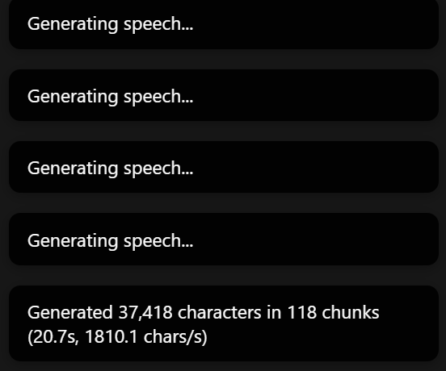
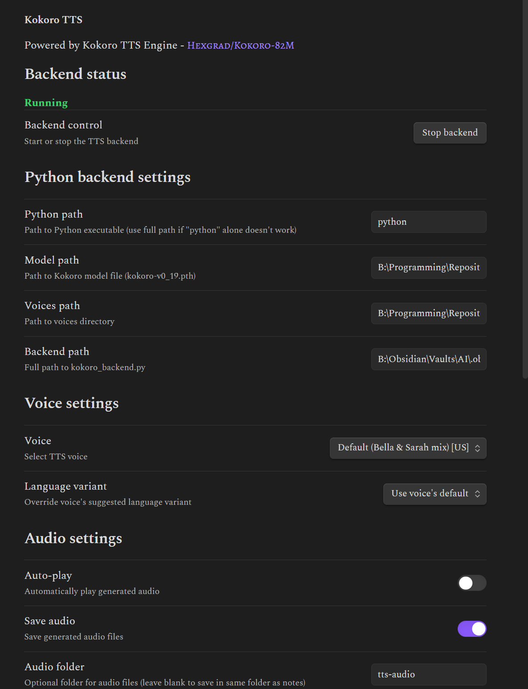
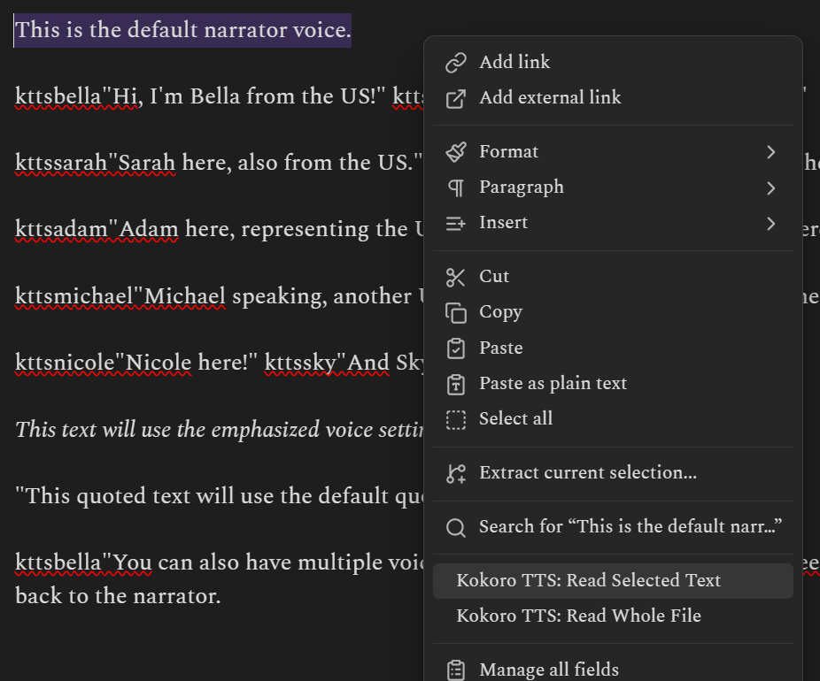
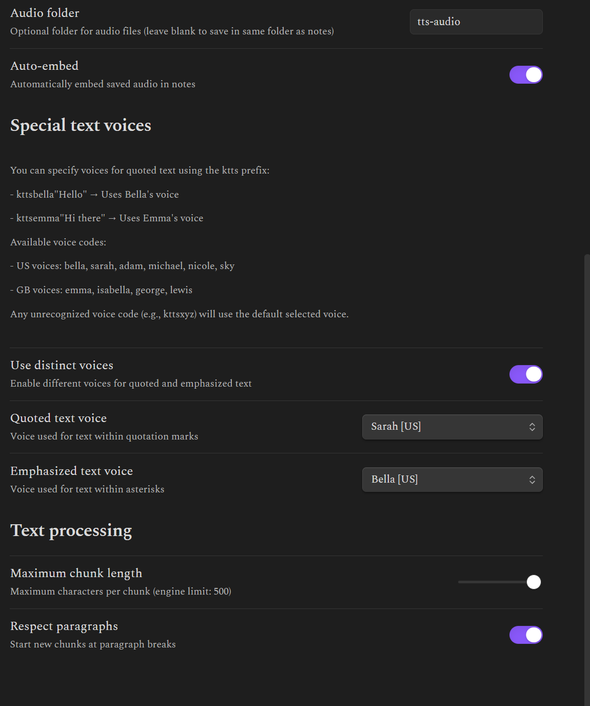

# Kokoro TTS Plugin for Obsidian

This plugin integrates the Kokoro TTS engine into Obsidian, providing high-quality text-to-speech with multiple voice options. It uses the lightweight Kokoro v0.19 model which offers natural-sounding speech in both American and British English.

I have only tested it in Windows 11, and it requires manual installation as it works with a locally hosted Kokoro TTS backend. The backend will use CUDA if available, or fallback to CPU.

NEW IN 1.3:
- Added inline voice selection with `ktts` prefix
- Added special voice settings for quoted and emphasized text
- Improved quote handling:
  * Support for all types of quotation marks (", ", ")
  * Fixed processing of multiple quoted sections on the same line
  * Better handling of quotes within sentences
- Added voice selection for emphasized text (within asterisks)
  * Text between * marks is now spoken without saying "asterisk"
  * Can assign a different voice for emphasized text in settings
- New Settings:
  * Special text voices section for configuring distinct voices
  * Toggle for enabling/disabling distinct voices feature
  * Separate voice selection for quoted and emphasized text

Here is a demonstration of the inline generation. This particular audio generated at 250 characters per second, despite switching between every available voice.


[Listen to the demo](res/quotes-example.wav)
```markdown
This is the default narrator voice.

kttsbella"Hi, I'm Bella from the US!" kttsemma"And I'm Emma from the UK!"

kttssarah"Sarah here, also from the US." kttsisabella"Isabella speaking, from the UK!"

kttsadam"Adam here, representing the US male voices." kttsgeorge"George here, from the UK!"

kttsmichael"Michael speaking, another US voice." kttslewis"And Lewis, another UK voice!"

kttsnicole"Nicole here!" kttssky"And Sky, wrapping up our voice demo!"

*This text will use the emphasized voice setting*

"This quoted text will use the default quote voice setting"

kttsbella"You can also have multiple voices in one paragraph!" kttsemma"Indeed you can!" And back to the narrator.
```


NEW IN 1.2:
- Force US/GB variant (very little impact)
- Fixed audio chunk concatenation
- Added message with generation stats (generation's total characters, chunks, time, and chunks/second)
- Tested on CPU (50-100 character/second) and CUDA, Kokoro is astonishingly fast (>1500 character/second on 4090).

 

## Features

- Multiple voice options (Bella, Sarah, Adam, Michael, Emma, Isabella, George, Lewis, Nicole, Sky)
- Support for both American and British English
- Advanced voice control:
  * Inline voice selection with `ktts` prefix
  * Distinct voices for quoted and emphasized text
  * Support for all types of quotation marks
  * Emphasis markers (*text*) without speaking the markers
- Text selection and full note reading
- Audio file saving and auto-embedding
- Configurable text processing (codeblocks, emphasis)
- Simple interface with keyboard shortcuts and context menu

## To do

- Add the possibility of merging voices at inference
- Add custom syntax options for saved audio file names

## Prerequisites

1. Python Environment:

   Note: The plugin requires NumPy < 2.0.0 for compatibility with PyTorch.

2. espeak-ng 1.51 (required for phonemization)
   - Windows: 
     * Download espeak-ng-1.51.msi from [espeak-ng releases](https://github.com/espeak-ng/espeak-ng/releases/tag/1.51)
     * Install the MSI package
   Note: Version 1.51 is required. Other versions may not work correctly.

3. Kokoro TTS model and voices
   - Download model file (`kokoro-v0_19.pth`) and voice files from [Kokoro-82M repository](https://huggingface.co/hexgrad/Kokoro-82M)

## Installation

### Manual Installation

1. Create a `kokoro-tts` folder in your vault's `.obsidian/plugins/` directory
2. Copy these files to the `kokoro-tts` folder:
   - `main.js`
   - `manifest.json`
   - `styles.css`
   - `kokoro_backend.py`
   - `requirements.txt`
3. Install Python dependencies:
   ```bash
   # If using conda (recommended):
   conda activate kokoro-tts
   pip install -r requirements.txt

   # If using system Python:
   cd YOUR_VAULT/.obsidian/plugins/kokoro-tts
   pip install -r requirements.txt
   ```
4. Enable the plugin in Obsidian's Community Plugins settings

### From Community Plugins (not available)

## Configuration

1. Open Settings → Kokoro TTS
2. Configure the required paths:
   - Python executable path (e.g., `python` or full path to Python)
   - Model path: Full path to `kokoro-v0_19.pth`
   - Voices path: Full path to the directory containing voice files
   - Backend script path: Path to `kokoro_backend.py` (default is in plugin directory)
3. Configure optional settings:
   - Voice selection
   - Audio settings (auto-play, save, embed)
   - Text processing options



### File Locations

The plugin expects the following structure:
```
YOUR_VAULT/
├── .obsidian/
│   └── plugins/
│       └── kokoro-tts/
│           ├── main.js
│           ├── manifest.json
│           ├── styles.css
│           ├── kokoro_backend.py    # Python backend script
│           └── requirements.txt     # Python dependencies
└── tts-audio/                      # Generated audio files (if enabled)
```

## Usage

### Commands

The plugin adds three commands that you can use:

1. **Read Highlighted Text**: Reads the currently selected text
2. **Read Whole Page**: Reads the entire current note
3. **Stop Speech**: Stops the current speech playback

Access these commands through:
- Command Palette (Ctrl/Cmd + P)
- Custom hotkeys (configurable in Settings → Hotkeys)
- Context menu (right-click on text)



### Special Text Voices

The plugin can use different voices for:
- Quoted text (any type of quotation marks)
- Emphasized text (text between asterisks)

Configure these options in Settings → Kokoro TTS → Special text voices.



### Inline Voice Selection

The plugin supports dynamic voice selection using inline codes:

- Use `ktts` followed by a voice name before quoted text:
  ```
  kttsbella"Hello everyone!" → Spoken by Bella
  kttsemma"Lovely weather!" → Spoken by Emma
  kttsadam"Hi there!" → Spoken by Adam
  ```

Available voice codes:
- US Voices: bella, sarah, adam, michael, nicole, sky
- GB Voices: emma, isabella, george, lewis

Notes:
- Any unrecognized voice code will use the default selected voice
- This feature works independently of the "Special text voices" settings
- Voice codes are case-sensitive

### Audio Files

If audio saving is enabled:
- Files are saved in the same folder as the note being read
- Files are named with the format: `notename_timestamp_chunk.wav`
- Files can be automatically embedded in notes at the cursor position
- Standard Obsidian audio player is used for playback
- Use the "Stop Speech" command or button to stop playback


### Troubleshooting

Use ctrl+shift+I to open the Obsidian developer console to identify errors.

## Support

- For plugin issues: [GitHub Issues](https://github.com/mithadon/obsidian-kokoro-tts-plugin/issues)
- For Kokoro TTS issues: [Kokoro Discord](https://discord.gg/QuGxSWBfQy)

## Credits

- [Kokoro TTS](https://huggingface.co/hexgrad/Kokoro-82M) by hexgrad
- [StyleTTS2](https://github.com/yl4579/StyleTTS2) architecture by Li et al.
- [espeak-ng](https://github.com/espeak-ng/espeak-ng) for phonemization
